# ECharts样例

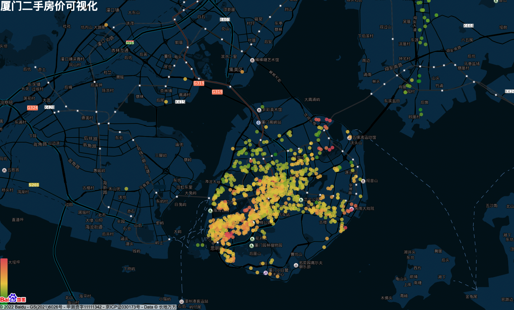

[厦门二手房价可视化](https://ni1o1.github.io/echartsexamples/xiamenhouseprice/)

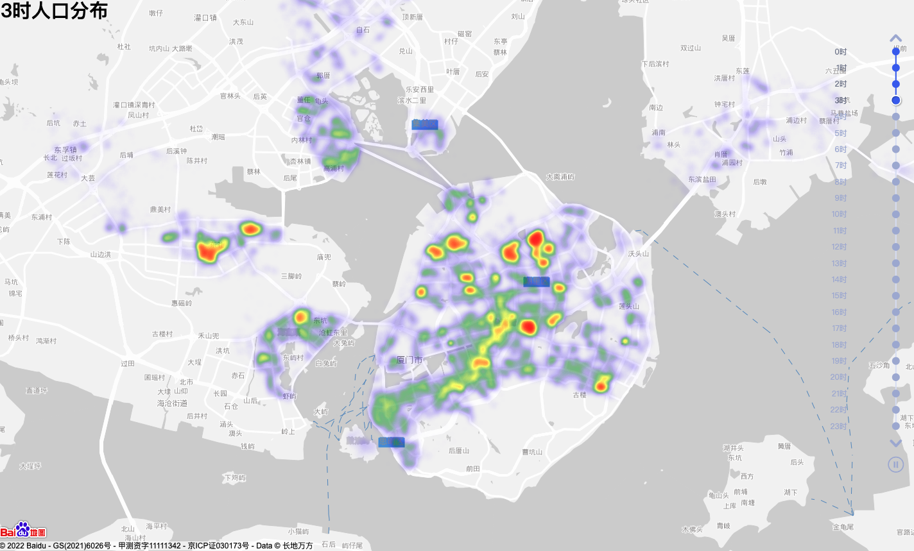

[厦门人口热力图](https://ni1o1.github.io/echartsexamples/heatmap/)

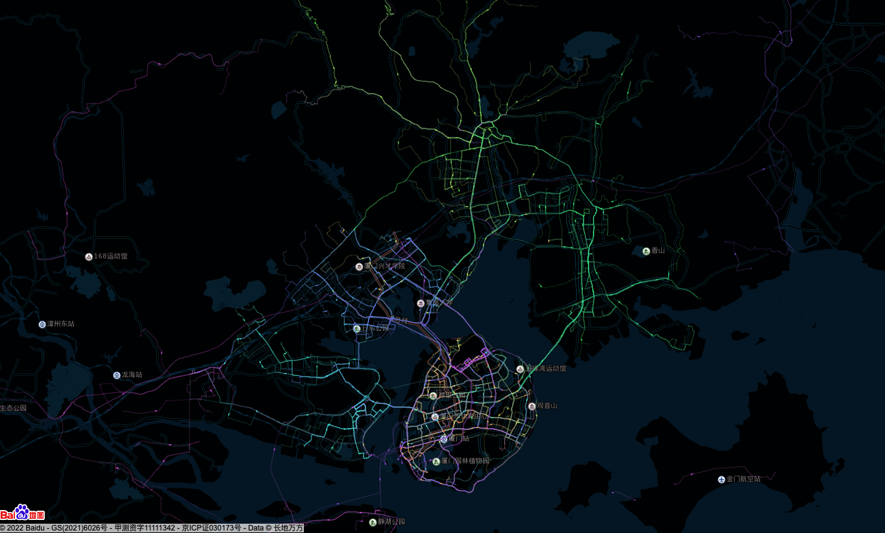

[厦门公交线路二维地图](https://ni1o1.github.io/echartsexamples/busline/)

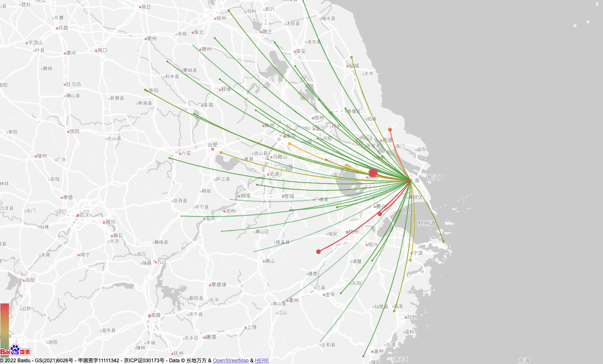

[长三角OD不带百度地图](https://ni1o1.github.io/echartsexamples/2dod/)

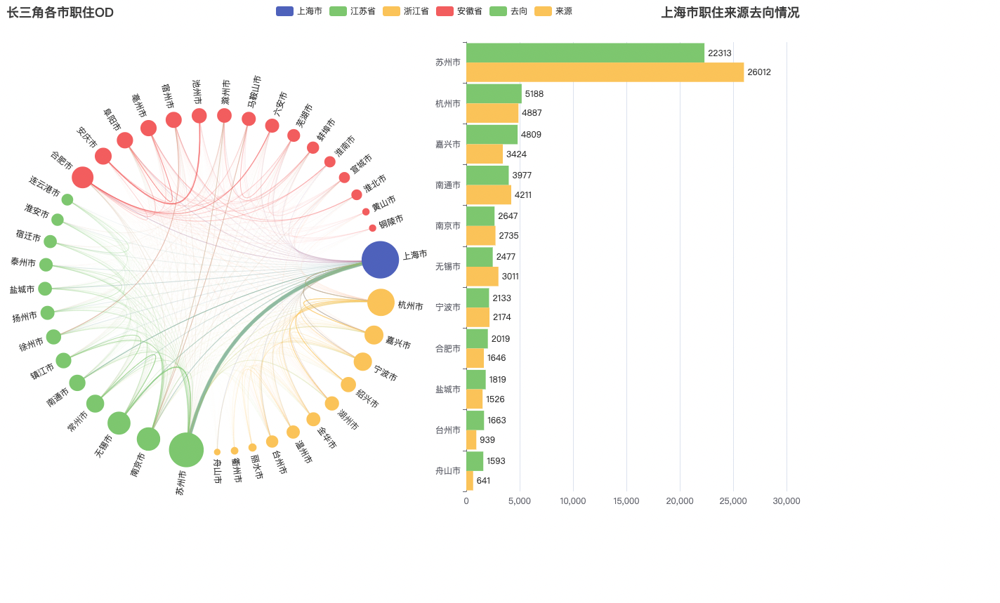

[交互OD图](https://ni1o1.github.io/echartsexamples/interactiveOD/)

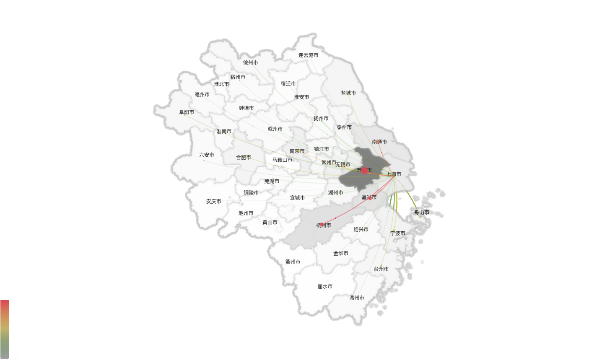

[长三角OD带百度地图](https://ni1o1.github.io/echartsexamples/oddata/)

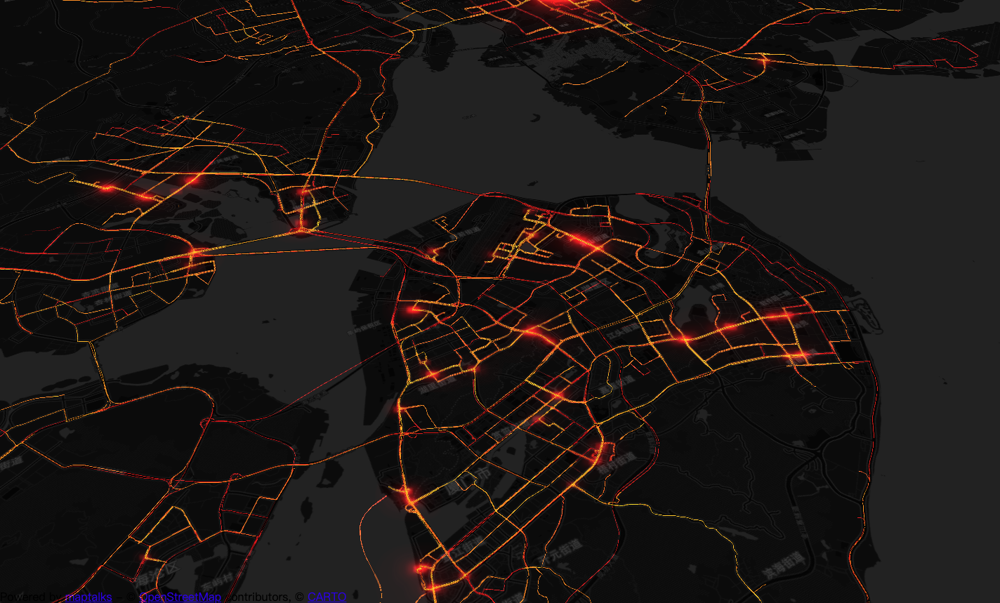

[厦门公交线路3D](https://ni1o1.github.io/echartsexamples/3dbus/)

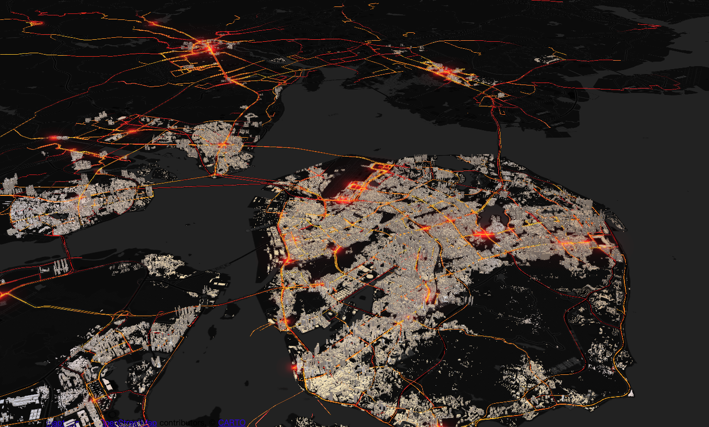

[厦门三维城市](https://ni1o1.github.io/echartsexamples/3dbuildings/)

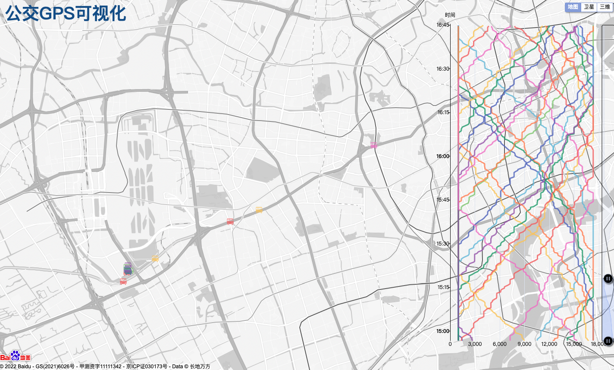

[71路公交GPS可视化](https://ni1o1.github.io/echartsexamples/bus71gps/)

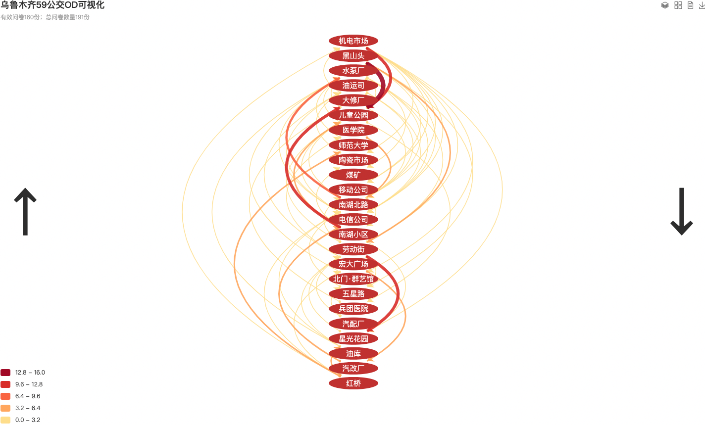

[公交OD彩虹图](https://ni1o1.github.io/echartsexamples/busOD/)

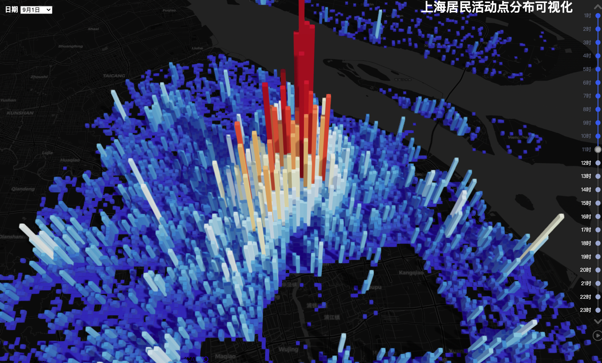

[上海居民活动分布3D柱状图](https://ni1o1.github.io/echartsexamples/activity3D/)

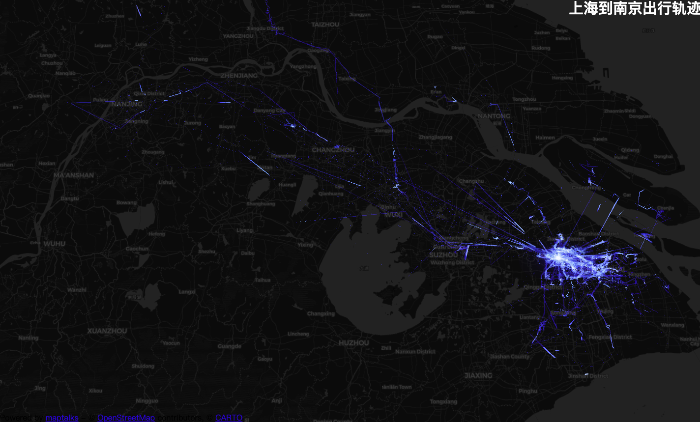

[上海到南京出行轨迹](https://ni1o1.github.io/echartsexamples/intercitytrip/)

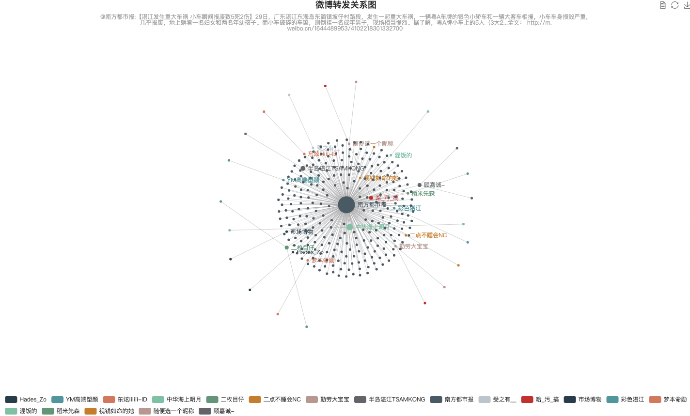

[微博转发关系图](https://ni1o1.github.io/echartsexamples/weibo/)

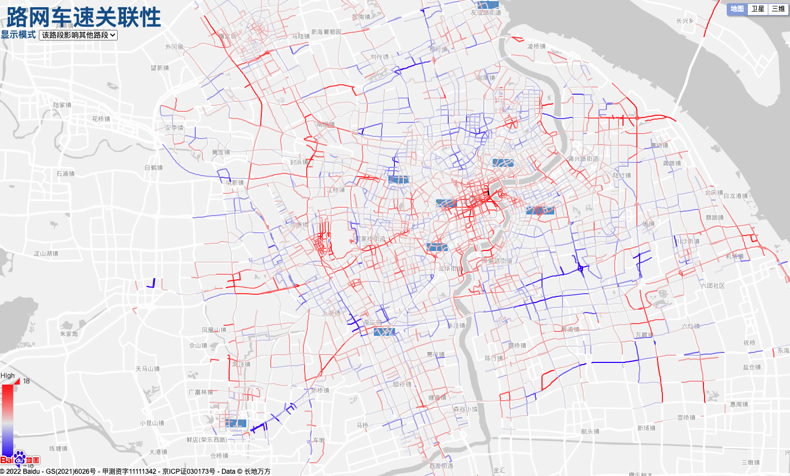

[上海市路网车速关联性](https://ni1o1.github.io/roadspeedcorr/)

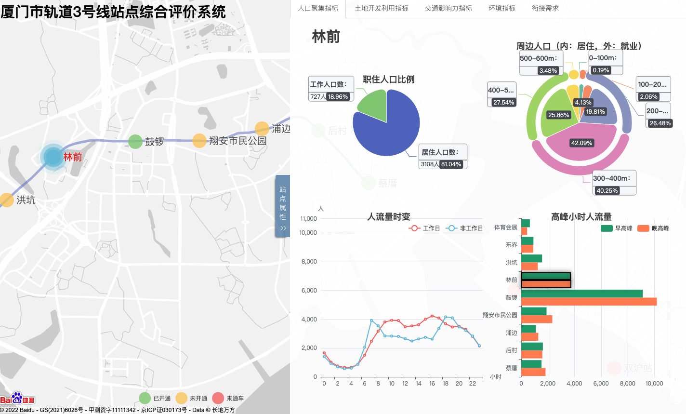

[厦门市轨道3号线站点综合评价系统](https://ni1o1.github.io/xiamenmetro/)

[城市居民活动空间可视化分析系统](https://ni1o1.github.io/activityspace_shanghai/)

[百度地图叠加geojson（自定义）](https://ni1o1.github.io/echartsexamples/mapgeojson/)
